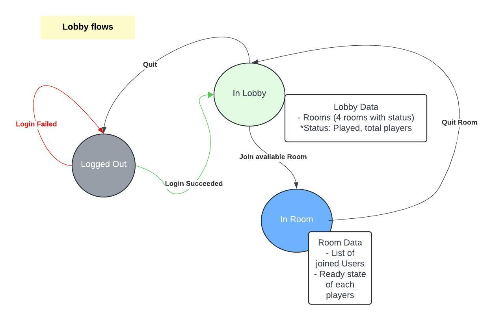

## Lobby flow

- Common Message Structure:
   ```json
   "tpe": <int message type>,
   "data": {
     //Json object
   }
   ```
   Message types:
    - 0 - Login Success
    - 1 - Lobby Message
    - 2 - Room Message

- Json Message format:
  + Login Success:
      ```json
        {
              "tpe": 1,
              data: {
                   "sessionId": "3asdff#asd",
              }
       }
  + LobbyData: 
  ```json
    {
          "tpe": 1,
          data: {
               "onlineCount": 8,
               "rooms": [
                 {"roomId": 1,"usersCount": 3, isStarted: False},
                 {"roomId": 2,"usersCount": 0, isStarted: False},
                 {"roomId": 3,"usersCount": 0, isStarted: False},
                 {"roomId": 4,"usersCount": 2, isStarted: False}
               ]
          }
   }
  ````
  ```
