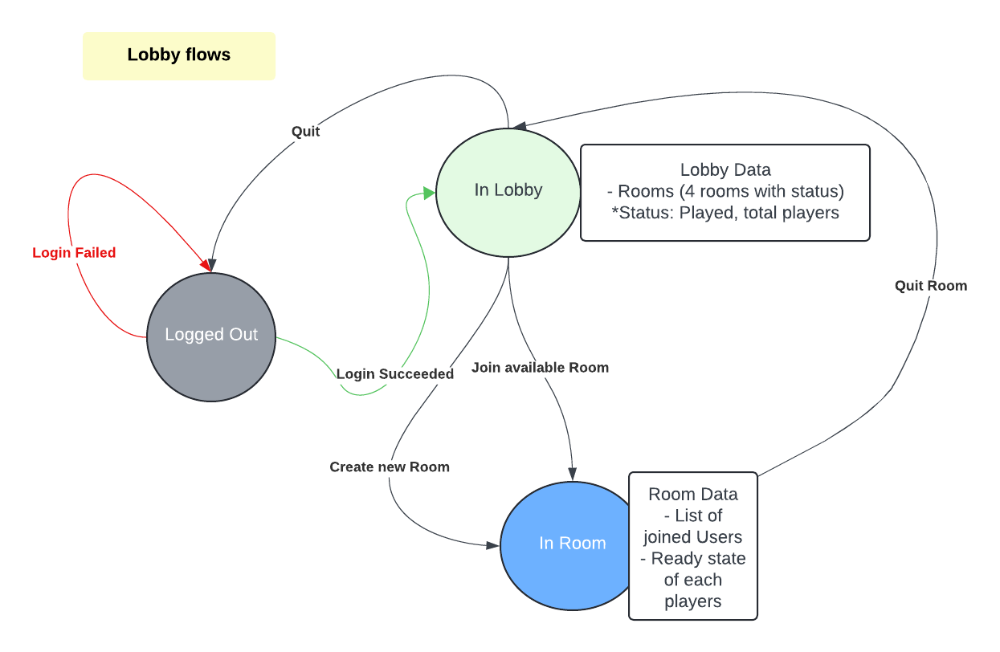

## Lobby flow

## Common Server Message Structure:
   ```json
   "tpe": <int message type>,
   "data": {
     //Json object
   }
   ```
   Message types: <br/>
    - 0 -> Login Success <br/>
    - 1 -> Lobby Message <br/>
    - 2 -> Room Message <br/>
    - 3 -> Room Joined

- Json Message format:
  + Login Success:
      ```json
        {
              "tpe": 1,
              data: {
                   "sessionId": "3asdff#asd",
              }
       }
  + LobbyData: 
  ```json
    {
          "tpe": 1,
          "data": {
               "onlineCount": 8,
               "rooms": [
                 {"roomId": 1,"usersCount": 3, "isStarted": false},
                 {"roomId": 2,"usersCount": 0, "isStarted": false},
                 {"roomId": 3,"usersCount": 0, "isStarted": false},
                 {"roomId": 4,"usersCount": 2, "isStarted": false}
               ]
          }
   }
  ```
  + Room joined:
    ```json
       {
         "tpe": 3,
         "data": {
            "roomId": <int room ID>,
            "players": [
               {"userId":  "abc", "isReady":  false},
               {"userId":  "def", "isReady":  true}
            ]
         }
       }
    ```
## Common Client Message Structure
   ```json
      "tpe": <int message type>,
      "sessionId": <session ID>,
      "data": {
          //Json object
      }
   ```
   - Join Room request:
     ```json
         "tpe": 3,
         "sessionId": <session ID>,
         "data": {
            roomId: <int room ID>
         }
     ```

   - Create Room request:
      ```json
          "tpe": 4,
          "sessionId": <session ID>,
          "data": {
             "roomName": <room Name>
         }
      ```
   
